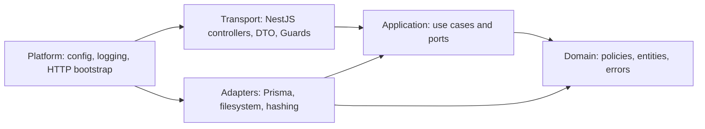

# Архитектура NestJS backend

- **Статус:** Draft
- **Дата:** 2026-08-04
- **Связанная задача:** [#10](https://github.com/Gigaw/JoinUp/issues/10)

## 1. Назначение

Документ определяет структуру NestJS-приложения, ответственность feature-модулей, направления
зависимостей, границы транзакций и стратегию тестирования. Он уточняет System Design, но не
дублирует HTTP DTO и database columns из соседних документов.

Backend реализуется как модульный монолит на NestJS с Fastify adapter. PostgreSQL остаётся
источником истины, а Prisma используется только через persistence-слой.

## 2. Архитектурные принципы

- Код группируется по business capability, а не в глобальные каталоги controllers/services.
- Контроллер принимает transport data, вызывает один application use case и преобразует результат.
- Бизнес-инварианты находятся в domain/application, а не в decorator, Guard или controller.
- Domain не зависит от NestJS, Fastify, Prisma, filesystem и environment variables.
- Application зависит от domain и объявляет порты к persistence и внешним возможностям.
- Persistence и platform adapters реализуют порты и зависят от Prisma, filesystem и framework API.
- Feature-модуль экспортирует только узкий application facade или token, а не repository и Prisma.
- Актор и resource ownership проверяются внутри use case; скрытая кнопка mobile не является защитой.
- Транзакция охватывает весь инвариант, но не содержит внешних сетевых или долгих файловых операций.
- Request-scoped providers не используются без измеримой необходимости.

## 3. Целевая структура

```text
apps/api/
  prisma/
    schema.prisma
    migrations/
  src/
    main.ts
    app.module.ts
    platform/
      config/
      database/
      http/
      idempotency/
      media/
      observability/
    modules/
      auth/
      users/
      cities/
      categories/
      events/
      participation/
    testing/
  test/
    e2e/
    integration/
    concurrency/
```

Каждый feature-модуль следует одной внутренней схеме:

```text
modules/events/
  events.module.ts
  transport/http/
    events.controller.ts
    dto/
    presenters/
  application/
    commands/
    queries/
    ports/
  domain/
    entities/
    policies/
    errors/
  persistence/prisma/
    prisma-event.repository.ts
    mappers/
```

Каталог создаётся только при наличии соответствующего кода. Пустые слои и generic abstractions
заранее не генерируются. Для небольшого read-only модуля `cities` структура может быть компактнее,
но направление зависимостей остаётся тем же.

## 4. Направления зависимостей



Application не импортирует concrete adapters. Nest module является composition root: связывает
application port token с Prisma/filesystem implementation через dependency injection.

Cross-module import разрешён только через явно экспортированный application interface. Запрещены:

- импорт controller, DTO или persistence adapter другого feature;
- прямой доступ к чужой Prisma-модели из controller/use case;
- circular module imports и `forwardRef` как постоянное архитектурное решение;
- общий `utils` или `common` каталог для несвязанных business helpers.

## 5. Bootstrap и HTTP pipeline

`main.ts` выполняет только composition и platform configuration:

1. валидирует environment configuration;
2. создаёт `NestFastifyApplication` через `FastifyAdapter`;
3. устанавливает `/v1` prefix;
4. включает global validation, request correlation и exception mapping;
5. подключает OpenAPI generation в разрешённых окружениях;
6. запускает server после успешной readiness initialization.

Global `ValidationPipe` использует allowlist DTO, `forbidNonWhitelisted: true` и не включает
неявное преобразование типов. Query parameters преобразуются явными DTO transformers.

Порядок обработки защищённого запроса:

```text
Fastify request
  → requestId / structured logging
  → SessionGuard
  → DTO validation
  → controller
  → application use case
  → transaction / ports
  → presenter DTO
  → global exception filter
```

Fastify request/reply types, multipart plugin и streaming находятся только в transport/platform.
Express-specific middleware не используется. Официальная документация NestJS предупреждает, что
Express recipes могут быть несовместимы с Fastify adapter.

## 6. Feature-модули

| Модуль | Ответственность | Не отвечает за |
| --- | --- | --- |
| `AuthModule` | register, login, logout, password hashing, session validation | публичный профиль и event authorization |
| `UsersModule` | собственный профиль, публичная projection, age visibility, interests | password/session lifecycle |
| `CitiesModule` | поддерживаемые города и time zones | свободный geocoding |
| `CategoriesModule` | active category catalog | рекомендации и moderation |
| `EventsModule` | event lifecycle, list/search/details, edit/cancel, ownership | join/application transitions |
| `ParticipationModule` | join, apply, approve, reject, withdraw, leave, participant/application reads | редактирование event content |
| `MediaModule` | local file validation, storage, read, replace and cleanup | business ownership policy |

`AppModule` импортирует feature и platform modules, но не содержит бизнес-логику.

### 6.1. Auth и users

Регистрация затрагивает user и session. `RegisterUser` использует `RegistrationUnitOfWork`, который
создаёт обе записи одной Prisma-транзакцией. `AgePolicy` работает с календарной датой и настроенной
product time zone. Исходный пароль существует только в transport/application scope до Argon2id
hashing и не журналируется.

`SessionGuard` проверяет hash bearer token и формирует минимальный `ActorContext` с `userId` и
`sessionId`. Guard не загружает профиль и не проверяет ownership event. Controller передаёт actor в
use case явно.

Users presenter имеет отдельные `MeDto`, `PublicUserDto` и `ParticipantDto`. Они строятся allowlist
mapping; Prisma object никогда не сериализуется напрямую. Только `MeDto` может содержать
`birthDate` и email.

### 6.2. Events и participation

`EventsModule` владеет event content и lifecycle. `ParticipationModule` владеет participation state
machine. Оба используют общий узкий `EventParticipationUnitOfWork` port для операций, которые
должны блокировать event row и менять обе таблицы атомарно.

Read-only список событий использует отдельный `EventListRepository` port. Prisma adapter выполняет
все SQL для полнотекстового поиска и cursor pagination; Russian `tsvector`/GIN expressions и
параметры поиска не выносятся в controller или application service. Application слой отвечает за
проверку поддерживаемого города, mapping результата и public projection.

Port реализуется одним Prisma adapter и предоставляет intent-oriented методы, например:

- `createEventWithOrganizerParticipation`;
- `joinOrApplyUnderEventLock`;
- `decideApplicationUnderEventLock`;
- `leaveOrWithdrawUnderEventLock`;
- `updateEventUnderLock`;
- `cancelEventUnderLock`.

Он не является generic repository. Внутри interactive transaction блокировка
`SELECT ... FOR UPDATE` выполняется безопасным tagged `$queryRaw`, затем данные перечитываются через
transaction client. Все writers блокируют event прежде participation, поэтому порядок блокировок
одинаков.

Application use case определяет допустимый переход и domain error. Adapter обеспечивает атомарность,
database constraints и persisted result, но не решает продуктовую политику самостоятельно.

### 6.3. Media

Feature use case сначала проверяет actor/ownership, затем вызывает `MediaStoragePort`. Local adapter
работает только внутри `MEDIA_ROOT`, проверяет magic bytes, MIME, размер и dimensions, пишет во
временный файл и выполняет atomic rename.

`@fastify/multipart` ограничивает размер и число parts на transport boundary. Local adapter
использует `sharp` для декодирования и нормализации JPEG, PNG и WebP: этим подтверждается
фактический формат до записи, а application-layer не зависит от Fastify, файловой системы или
image decoder.

Filesystem и PostgreSQL не образуют общую транзакцию. Поэтому replace flow использует порядок:

1. проверить и записать новый temporary file;
2. atomically переместить его под новым opaque key;
3. обновить database reference;
4. после commit удалить старый файл;
5. при database failure удалить новый либо оставить его housekeeping для безопасной очистки.

Переход на Amazon S3 реализуется новым adapter без изменения application port или публичных DTO.

## 7. Persistence и транзакции

`DatabaseModule` создаёт один lifecycle-managed `PrismaClient`. Feature repositories получают его
через явный import; модуль не делается глобальным только ради сокращения boilerplate.

Обязательные transaction boundaries:

- user + session при registration;
- event + organizer participation при create;
- любое изменение event capacity/status и participation;
- reservation/completion idempotency record вместе с event/media database mutation;
- полная замена user interests.

Read queries не открывают transaction без необходимости. Pagination и counts выполняются
предсказуемыми запросами с индексами из data model.

Prisma Schema описывает базовые relations и indexes. SQL migrations дополняют её constraints,
которые нельзя выразить Prisma. Raw SQL разрешён только в persistence/migrations, всегда
параметризован и покрыт integration tests.

## 8. Идемпотентность и retry

`IdempotencyService` не является прозрачным interceptor, потому что reservation key и business
mutation должны разделять transaction и operation name. Controller передаёт header, а use case:

1. нормализует operation и вычисляет request hash;
2. резервирует `(userId, operation, key)`;
3. возвращает сохранённый response при совпавшем hash;
4. отклоняет reuse ключа с другим request;
5. выполняет mutation и сохраняет безопасный result;
6. replay-ит result до истечения 7-дневного storage window.

Participation `PUT`/`DELETE` дополнительно защищены unique constraint и state-aware поведением.
Database/network transient retry повторяет всю transaction ограниченное число раз. Domain conflicts
не повторяются автоматически.

## 9. Authorization

- `SessionGuard` отвечает только за действующую сессию.
- Public reference endpoints явно помечаются как anonymous; отсутствие decorator означает auth.
- Ownership события проверяет application use case после загрузки актуального event.
- Organizer decision проверяет event, participation и actor в одной transaction.
- Пользователь может изменять только собственный profile/media.
- Cancelled event visibility проверяется query use case согласно API matrix.
- Pending applications выдаются только организатору и владельцу заявки через разные projections.

Повторная проверка в persistence может защищать критический write, но не заменяет application policy.

## 10. Ошибки и logging

Domain/application выбрасывают типизированные ошибки без HTTP status. Global exception filter
преобразует их в API error contract: `code`, безопасный `message`, optional `details`, `requestId`.

- validation errors → `400`;
- invalid session → `401`;
- authorization/ownership → `403`;
- unavailable resource → `404`;
- state/capacity/version/idempotency conflicts → `409`;
- age restriction → `422`;
- unexpected errors → `500` и internal log.

Controller не содержит `try/catch` для стандартного mapping. Logs структурированы и включают route,
status, duration и requestId. Password, bearer token, birth date, raw multipart body и filesystem
path редактируются до записи.

## 11. Configuration и runtime

Configuration schema валидируется до запуска. Минимальные группы:

- HTTP host/port и environment;
- PostgreSQL connection;
- session lifetime и token hashing secret/parameters;
- product age-policy time zone;
- `MEDIA_ROOT` и upload limits;
- log level и безопасные observability settings.

Feature code получает typed config через узкие providers и не читает `process.env` напрямую.
Secrets не имеют development default, который мог бы случайно попасть в production-like окружение.

Liveness сообщает, что process работает. Readiness проверяет PostgreSQL и доступность writable
`MEDIA_ROOT`. Migration выполняется отдельной командой deployment до старта новой версии API.

## 12. OpenAPI и API client

Transport DTO и explicit Swagger decorators формируют детерминированный OpenAPI document. Отдельная
команда экспортирует схему без запуска внешнего listener, затем генерирует `packages/api-client`.

CI завершается ошибкой, если после генерации изменились OpenAPI или generated client. Generated
files не редактируются вручную. Public projections и error responses описываются явно для каждого
route; generic `any` response запрещён.

## 13. Стратегия тестирования

### 13.1. Unit tests

- age calculation на границе дня рождения;
- event/participation state transitions;
- capacity, ownership и terminal-state policies;
- request hash и error mapping;
- use cases с in-memory/fake ports без Nest testing module, когда DI graph не нужен.

### 13.2. Integration tests

Запускаются на реальном PostgreSQL:

- Prisma repository и SQL migrations;
- unique/foreign/check constraints;
- transaction rollback;
- session expiry/revocation;
- idempotency reservation/replay/cleanup;
- media adapter с temporary `MEDIA_ROOT`.

SQLite не заменяет PostgreSQL в этих тестах.

### 13.3. Concurrency tests

Используют разные database connections и синхронизированный старт:

- две попытки занять последнее место;
- два одновременных approvals;
- approval против automatic join;
- leave против approval;
- capacity edit против join;
- retry одного idempotency key.

Тест проверяет database state, а не только HTTP responses.

### 13.4. HTTP e2e и contract tests

Nest application поднимается in-process с Fastify adapter. Проверяются validation, authentication,
authorization, response DTO, error codes и multipart limits. Contract suite сравнивает фактические
ответы ключевых endpoints с OpenAPI и отдельно подтверждает отсутствие `birthDate` в public user,
organizer и participant APIs.

## 14. Запрещённые сокращения

- business logic в controller, Guard, Prisma middleware или DTO decorator;
- сериализация Prisma model напрямую;
- один глобальный `AppService` для разных модулей;
- generic repository для всех entities;
- `forwardRef` вместо исправления module boundary;
- raw SQL через unsafe string concatenation;
- automatic retry domain conflicts;
- filesystem path из client input;
- Redis, queue или event bus до отдельной задачи и ADR.

## 15. Связанные документы

- [Системная архитектура](system-design.md)
- [Модель данных](data-model.md)
- [API-контракты](api-contracts.md)
- [ADR 0001: технологический стек](../adr/0001-technology-stack.md)
- [ADR 0003: PostgreSQL и Prisma](../adr/0003-database-access.md)
- [ADR 0004: серверные сессии](../adr/0004-authentication-sessions.md)
- [ADR 0005: конкурентное участие](../adr/0005-participation-concurrency.md)
- [ADR 0007: локальное media storage](../adr/0007-local-media-storage.md)
- [NestJS: Modules](https://docs.nestjs.com/modules)
- [NestJS: Fastify adapter](https://docs.nestjs.com/techniques/performance)
- [NestJS: Guards](https://docs.nestjs.com/guards)
- [NestJS: Exception filters](https://docs.nestjs.com/exception-filters)
- [Prisma: Raw queries](https://docs.prisma.io/docs/orm/prisma-client/using-raw-sql/raw-queries)
