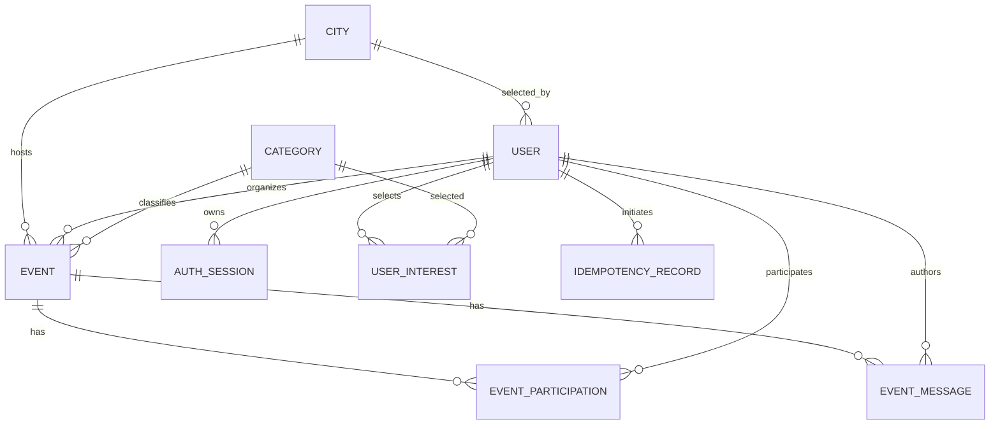

# Модель данных первого рабочего каркаса

- **Статус:** Draft
- **Дата:** 2026-08-03
- **Связанная задача:** [#9](https://github.com/Gigaw/JoinUp/issues/9)

## 1. Принципы

- PostgreSQL является источником истины; Prisma Schema не заменяет database constraints.
- Идентификаторы публичных сущностей являются непрозрачными UUID.
- Все timestamps хранятся в UTC; дата рождения хранится как PostgreSQL `date`.
- Названия полей в схеме и API пишутся на английском.
- Организатор представлен одновременно `events.organizer_id` и participation-записью `going`.
- Количество участников вычисляется по `going`, а не хранится отдельным счётчиком.
- Текущая participation-запись уникальна для пары event/user.
- Приватные данные отделяются публичными projections на уровне application и transport.

Физические имена таблиц и columns приводятся в `snake_case`. Prisma-модели могут использовать
`PascalCase` и `camelCase` с явным mapping.

## 2. Связи сущностей



## 3. Таблицы

### 3.1. `users`

| Поле | Тип | Ограничения и назначение |
| --- | --- | --- |
| `id` | `uuid` | Primary key |
| `email` | `text` | Исходное нормализованное значение для входа; не публичное |
| `email_normalized` | `text` | Lowercase/trimmed, unique |
| `password_hash` | `text` | Argon2id hash; не публичное |
| `display_name` | `varchar(80)` | Обязательное после онбординга |
| `birth_date` | `date` | Private, never returned by public APIs |
| `show_age` | `boolean` | `NOT NULL DEFAULT false` |
| `city_id` | `uuid` nullable | Поддерживаемый город пользователя |
| `bio` | `varchar(500)` nullable | Публичное описание профиля |
| `avatar_object_key` | `text` nullable | Opaque key внутри `MEDIA_ROOT`, не публичный filesystem path |
| `onboarding_completed_at` | `timestamptz` nullable | Установлен после обязательных полей и минимум одного интереса |
| `created_at` | `timestamptz` | Время создания |
| `updated_at` | `timestamptz` | Время последнего изменения |

`birth_date` используется только auth/users application-сценариями. Любая публичная проекция
строит optional `age` на backend при `show_age = true`. Возраст не сохраняется отдельной колонкой,
поскольку он меняется со временем.

`email_normalized` имеет уникальный индекс. Ответы регистрации и входа не должны позволять
получить `password_hash` или определить дату рождения через сериализацию Prisma-модели.

### 3.2. `auth_sessions`

| Поле | Тип | Ограничения и назначение |
| --- | --- | --- |
| `id` | `uuid` | Primary key |
| `user_id` | `uuid` | FK → `users.id` |
| `token_hash` | `text` | Unique hash непрозрачного session token |
| `expires_at` | `timestamptz` | Обязательный срок действия |
| `revoked_at` | `timestamptz` nullable | Немедленный отзыв при logout |
| `last_used_at` | `timestamptz` nullable | Диагностика без обязательного обновления на каждый запрос |
| `created_at` | `timestamptz` | Время создания |

Активной считается сессия без `revoked_at` и с `expires_at > now()`. Токен в исходном виде никогда
не сохраняется. Индекс по `token_hash` используется Guard; индекс по `(user_id, created_at)` служит
точкой расширения будущего управления сессиями.

### 3.3. `cities`

| Поле | Тип | Ограничения и назначение |
| --- | --- | --- |
| `id` | `uuid` | Primary key |
| `slug` | `varchar(80)` | Unique стабильный идентификатор |
| `name` | `varchar(120)` | Отображаемое название |
| `time_zone` | `varchar(64)` | IANA time zone |
| `is_supported` | `boolean` | Доступность для выбора и новых событий |
| `sort_order` | `integer` | Порядок в справочнике |

Город не вводится свободным текстом. Отключение города запрещает новый выбор, но не удаляет
существующие ссылки.

### 3.4. `categories`

| Поле | Тип | Ограничения и назначение |
| --- | --- | --- |
| `id` | `uuid` | Primary key |
| `slug` | `varchar(80)` | Unique стабильный идентификатор |
| `name` | `varchar(120)` | Отображаемое название |
| `is_active` | `boolean` | Доступность для интересов и новых событий |
| `sort_order` | `integer` | Порядок в справочнике |

Стартовый набор категорий остаётся продуктовым вопросом. Схема хранит справочник, но не фиксирует
его содержимое.

### 3.5. `user_interests`

| Поле | Тип | Ограничения и назначение |
| --- | --- | --- |
| `user_id` | `uuid` | FK → `users.id` |
| `category_id` | `uuid` | FK → `categories.id` |
| `created_at` | `timestamptz` | Время выбора |

Составной primary key `(user_id, category_id)` исключает дубликаты. Требование минимум одного
интереса проверяется application-слоем при завершении онбординга.

### 3.6. `events`

| Поле | Тип | Ограничения и назначение |
| --- | --- | --- |
| `id` | `uuid` | Primary key и row-lock target |
| `organizer_id` | `uuid` | FK → `users.id`, immutable |
| `city_id` | `uuid` | FK → `cities.id` |
| `category_id` | `uuid` | FK → `categories.id` |
| `title` | `varchar(80)` | 3–80 символов |
| `description` | `varchar(2000)` | 10–2000 символов |
| `meeting_place` | `varchar(300)` | 3–300 символов, видно авторизованным пользователям |
| `starts_at` | `timestamptz` | Должно быть в будущем при создании |
| `ends_at` | `timestamptz` nullable | Если задано, позже `starts_at` |
| `capacity` | `integer` | `CHECK (capacity >= 2)` |
| `participation_mode` | enum | `automatic`, `approval_required` |
| `status` | enum | `draft`, `published`, `cancelled`, `completed`, `hidden` |
| `version` | `integer` | `NOT NULL DEFAULT 1`; увеличивается при каждом mutation |
| `content_version` | `integer` | `NOT NULL DEFAULT 1`; увеличивается при значимом редактировании |
| `image_object_key` | `text` nullable | Opaque key внутри `MEDIA_ROOT` |
| `cancelled_at` | `timestamptz` nullable | Заполняется при cancellation |
| `created_at` | `timestamptz` | Время создания |
| `updated_at` | `timestamptz` | Время последнего изменения |

Первый каркас создаёт событие сразу со статусом `published` и поддерживает пользовательский переход
только `published → cancelled`. `completed` может устанавливаться техническим процессом позднее;
до его появления прошедшее событие определяется по `starts_at`. `draft` и `hidden` зарезервированы
PRD, но endpoints и workflows для них отсутствуют.

`version` используется для optimistic concurrency редактирования. `content_version` увеличивается
при изменении даты, времени, города или места. Participation хранит последнюю увиденную content
version, поэтому «Мои активности» может показать отметку обновления без push или отдельного
notification center. При создании participation её `seen_event_version` равна текущей
`content_version` события.

Основные индексы:

- `(city_id, status, starts_at, id)` для основной ленты и cursor pagination;
- `(organizer_id, starts_at)` для созданных событий;
- `(category_id, starts_at)` как дополнительный filter path;
- GIN expression index с `to_tsvector('russian', ...)` по title, description и meeting place;
- GIN expression index с `to_tsvector('russian', ...)` по category name для поиска по справочнику;
- полнотекстовый поиск выполняется persistence adapter параметризованным raw SQL, без внешнего
  поискового сервиса.

### 3.7. `event_participations`

| Поле | Тип | Ограничения и назначение |
| --- | --- | --- |
| `id` | `uuid` | Primary key, публичный application identifier |
| `event_id` | `uuid` | FK → `events.id` |
| `user_id` | `uuid` | FK → `users.id` |
| `status` | enum | `pending`, `going`, `rejected`, `withdrawn`, `cancelled` |
| `seen_event_version` | `integer` | Последняя версия события, просмотренная пользователем |
| `created_at` | `timestamptz` | Время первой связи с событием |
| `status_changed_at` | `timestamptz` | Время последнего перехода |
| `updated_at` | `timestamptz` | Время последнего изменения записи |

Unique constraint `(event_id, user_id)` гарантирует одну текущую связь. Запись не удаляется при
withdrawal или cancellation. Повторная подача после `rejected` или `withdrawn` не входит в первый
каркас: join/apply возвращает conflict, пока отдельное продуктовое решение не разрешит переход.

Организатор имеет participation `going` с момента создания события и не может перейти в
`cancelled`; он отменяет всё событие. Статус `removed` из более широкого PRD не входит в первый
каркас: возможность удаления участника требует отдельного продуктового решения и migration перед
реализацией.

Индексы:

- unique `(event_id, user_id)`;
- `(event_id, status, created_at)` для participants/applications и подсчёта вместимости;
- `(user_id, status, updated_at)` для «Моих активностей».

### 3.8. `event_messages`

| Поле | Тип | Ограничения и назначение |
| --- | --- | --- |
| `id` | `uuid` | Primary key, cursor tie-breaker |
| `event_id` | `uuid` | FK → `events.id`, `ON DELETE CASCADE` |
| `author_id` | `uuid` | FK → `users.id`, `ON DELETE RESTRICT` для сохранения авторства истории |
| `text` | `varchar(1000)` | Trimmed текст организационного сообщения, 1–1000 символов |
| `created_at` | `timestamptz` | Время публикации, immutable |

У события нет отдельной сущности чата: его scope задаёт `event_id`. Индекс
`(event_id, created_at, id)` поддерживает обратную cursor pagination. Текст и author projection
доступны только организатору и актуальному участнику `going`. При записи transaction сначала
блокирует строку event, затем повторно читает participation; это исключает отправку одновременно
с переходом participation в terminal status.

Сообщения становятся read-only после `starts_at` или отмены. Они выдаются не более 30 дней после
`ends_at` (либо `starts_at`, если конец не задан) или `cancelled_at`; затем scheduled housekeeping
удаляет записи. Текст не записывается в application/technical logs или analytics. До #7 нет
пользовательского удаления, редактирования и модераторского доступа.

### 3.9. `idempotency_records`

| Поле | Тип | Ограничения и назначение |
| --- | --- | --- |
| `id` | `uuid` | Primary key |
| `user_id` | `uuid` | FK → `users.id` |
| `operation` | `varchar(120)` | Стабильное имя mutation |
| `key` | `varchar(128)` | Значение `Idempotency-Key` |
| `request_hash` | `text` | Hash нормализованного существенного request body |
| `response_status` | `integer` nullable | HTTP status завершённой операции |
| `response_body` | `jsonb` nullable | Безопасный сериализованный результат для replay |
| `resource_id` | `uuid` nullable | Созданная или изменённая сущность |
| `completed_at` | `timestamptz` nullable | Признак завершённой операции |
| `expires_at` | `timestamptz` | Конец хранения и replay; 7 дней для первого каркаса |
| `created_at` | `timestamptz` | Время резервирования ключа |

Unique `(user_id, operation, key)` не позволяет выполнить одну операцию повторно. Повтор с другим
`request_hash` возвращает `IDEMPOTENCY_KEY_REUSED`. Response body не должен содержать bearer token,
пароль, дату рождения или другие поля, которые нельзя хранить в техническом журнале. Поэтому
idempotency storage применяется к event, media и message mutations, но не к login/registration
responses.
Публично гарантированное окно replay составляет минимум 24 часа; первый каркас сохраняет запись и
результат 7 дней, после чего housekeeping может удалить их.

## 4. Инварианты и место их защиты

| Инвариант | Application/transaction | Database |
| --- | --- | --- |
| Пользователь при регистрации достиг 18 лет | Расчёт по `birth_date` и policy time zone | `birth_date NOT NULL`; смысл проверяет backend |
| Дата рождения не публична | Отдельные DTO/projections | Нет прямого доступа client к DB |
| Организатор является участником | Event create use case создаёт обе записи атомарно | FK и unique participation |
| Организатор учитывается в capacity | Подсчёт всех `going` | `capacity >= 2` |
| Pending не резервирует место | Capacity считает только `going` | Индекс ускоряет count по status |
| Не больше capacity участников | Row lock и count в транзакции | Все writers блокируют один event row |
| Нет дубликата участия/заявки | Проверка перехода и idempotent response | Unique `(event_id, user_id)` |
| После заполнения pending отклоняются | Массовый update в той же транзакции | Атомарность транзакции |
| После старта/отмены нет изменений участия | Проверка после row lock | Статус и время хранятся в event |
| Organizer не отказывается от участия | Проверка `organizer_id` | Participation остаётся `going` |
| Capacity не уменьшается ниже going count | Проверка под event row lock | `capacity >= 2` |
| Сообщение не создаётся после terminal participation | Event lock, затем актуальная `going` participation | FK и единый порядок блокировки |

## 5. Протокол конкурентной записи

Любой use case, способный изменить количество или статус участия, выполняет:

```text
BEGIN
SELECT id FROM events WHERE id = :eventId FOR UPDATE
-- перечитать event и participation внутри transaction
-- проверить status, starts_at, ownership, mode и going count
-- применить один допустимый переход
-- при going count == capacity: pending -> rejected
COMMIT
```

Raw SQL параметризуется и инкапсулируется в persistence adapter. Все операции блокируют сначала
event и только потом participation, поэтому не возникает разных порядков блокировок. При database
deadlock или transient serialization error API может повторить всю transaction ограниченное число
раз; повтор use case всё равно проверяет текущее состояние.

## 6. Публичные проекции и приватность

| Проекция | Разрешённые пользовательские поля |
| --- | --- |
| `Me` | email, display name, birth date, show-age setting, city, interests, onboarding status |
| `PublicUser` | id, display name, avatar URL, bio, city, interests, optional calculated age |
| `Participant` | id, display name, avatar URL, optional calculated age |
| `Organizer` | поля `PublicUser` и ближайшие опубликованные события по отдельному запросу |

`birth_date` разрешена только в `Me`; transport serializer использует allowlist DTO, а не исключение
полей из Prisma object. Даже `Me` не возвращает `password_hash`, session hashes и технические auth
поля.

Текстовое место встречи и список `going` участников доступны любому авторизованному пользователю,
который может открыть событие. Pending applications доступны только организатору соответствующего
события и самому заявителю в его «Моих активностях».

Текст `event_messages` и имя автора доступны только organizer и текущим `going` participants этого
же event. Они не включаются в analytics или технические журналы; access проверяется до чтения
страницы и повторно под event lock до записи.

## 7. Удаление и хранение

Обычная отмена события меняет статус и не удаляет event или participation. Срок хранения
завершённых и отменённых событий остаётся открытым продуктовым вопросом. До его решения внешние
foreign keys используют поведение, исключающее случайное каскадное удаление истории. Сообщения
чата удаляются housekeeping-процессом через 30 дней после окончания или отмены активности; до
этого они остаются доступны только для чтения после terminal state.

Удаление аккаунта, анонимизация и retention пользовательских media objects будут определены до
публичного релиза. Технические записи идемпотентности хранятся 7 дней и удаляются отдельной
безопасной housekeeping-операцией.

## 8. Связанные документы

- [Product Requirements Document](../product/prd.md)
- [Открытые продуктовые вопросы](../product/open-questions.md)
- [Системная архитектура](system-design.md)
- [API-контракты](api-contracts.md)
- [ADR 0003: PostgreSQL и Prisma](../adr/0003-database-access.md)
- [ADR 0004: аутентификация и серверные сессии](../adr/0004-authentication-sessions.md)
- [ADR 0005: конкурентное участие](../adr/0005-participation-concurrency.md)
- [ADR 0007: локальное хранение изображений](../adr/0007-local-media-storage.md)
