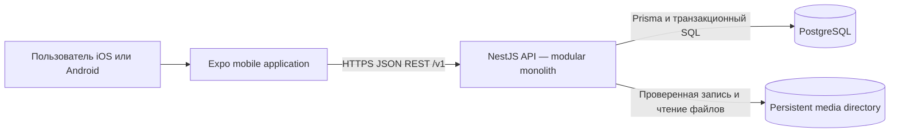

# Системная архитектура первого рабочего каркаса

- **Статус:** Draft
- **Дата:** 2026-08-03
- **Связанная задача:** [#9](https://github.com/Gigaw/JoinUp/issues/9)

## 1. Назначение

Документ определяет границы системы «Вместе», ответственность runtime-компонентов, основные потоки
данных и обязательные свойства безопасности и надёжности. Детали модулей mobile и backend будут
описаны в задачах #10, а конкретные таблицы и HTTP-контракты находятся в соседних документах.

Архитектура рассчитана на первый рабочий каркас и закрытый пилот в одном городе или ограниченном
регионе. Она не предполагает микросервисы, real-time доставку или полноценный offline-first режим.

## 2. Цели и ограничения

Система должна:

- поддерживать iOS и Android через Expo;
- обеспечивать регистрацию и вход по email и паролю;
- проверять совершеннолетие на backend и не раскрывать дату рождения;
- поддерживать создание, чтение, редактирование и отмену событий;
- безопасно обрабатывать автоматическое участие и заявки при конкурентных запросах;
- сохранять типизированный, версионируемый контракт между mobile и backend;
- корректно работать при повторных запросах и нестабильной мобильной сети;
- обходиться PostgreSQL без Redis, очередей и поискового сервиса на первом этапе.

В первый рабочий каркас не входят карты и геолокация, push- и email-уведомления, жалобы,
блокировки, административная панель и платежи. Event-scoped чаты входят в текущий каркас; личные
сообщения и социальная механика остаются за его пределами. Для отложенных возможностей сохраняются
границы расширения, но не создаются неиспользуемые runtime-компоненты, таблицы или endpoints.

## 3. Контекст системы

### 3.1. Mobile application

Mobile отвечает за пользовательский интерфейс, навигацию, хранение session token в SecureStore,
клиентскую валидацию для быстрого feedback и кеширование server state через TanStack Query.

Mobile считается недоверенным клиентом. Он может скрывать недоступные действия, но backend всегда
повторно проверяет возраст, авторизацию, владельца, статус события, время начала, вместимость и
допустимость перехода участия.

### 3.2. NestJS API

API является единственной точкой доступа к данным. Он выполняет authentication, authorization,
runtime-валидацию, orchestration application-сценариев и преобразование domain-результатов в
публичные DTO. Backend первого каркаса разворачивается одним экземпляром за TLS-терминатором.
Application state остаётся в PostgreSQL, но локальное media storage временно делает API stateful
относительно файлов. Горизонтальное масштабирование требует общего persistent volume либо перехода
на object storage.

Runtime-модули первого каркаса:

- `auth` — регистрация, вход, выход и проверка сессии;
- `users` — собственный профиль, публичная проекция и интересы;
- `cities` — поддерживаемый список городов;
- `categories` — справочник категорий;
- `events` — список, поиск, детали, создание, редактирование и отмена;
- `participation` — присоединение, заявки и решения организатора;
- `chats` — event-scoped сообщения для организатора и актуальных участников;
- `media` — проверенная запись, чтение и удаление локальных изображений.

Модули жалоб, блокировок, модерации, уведомлений и платежей не создаются до соответствующих задач.
Будущие интеграции подключаются через application ports, а не прямыми вызовами из контроллеров или
domain-сущностей.

### 3.3. PostgreSQL

PostgreSQL является источником истины для пользователей, сессий, справочников, событий, участия и
идемпотентных операций. Prisma обслуживает обычные запросы и миграции. Ограничения и блокировки,
которые Prisma не выражает, реализуются рецензируемым SQL в migration и persistence-слое.

Кеширующая база, брокер сообщений и отдельный поисковый движок отсутствуют. Поиск первого пилота
выполняется PostgreSQL; необходимость дополнительных индексов определяется по реальным запросам.

### 3.4. Локальное media storage

Изображения профиля и события хранятся вне Git и application image в каталоге `MEDIA_ROOT` на
persistent volume. PostgreSQL содержит только относительный opaque storage key. API проверяет
authentication, ownership, фактический тип и размер изображения, записывает файл через temporary
path и не принимает filesystem path от клиента.

Отказ после записи файла, но до обновления базы, может оставить orphaned file. Такой файл удаляется
периодической housekeeping-операцией. Переход на object storage скрывается за media adapter и не
меняет публичный DTO.

## 4. Границы доверия и данных

| Граница | Правило |
| --- | --- |
| Mobile → API | Все поля валидируются; идентификатор пользователя берётся только из сессии |
| API → PostgreSQL | Запросы параметризованы; бизнес-запись проходит через application и persistence |
| Публичная проекция пользователя | Никогда не содержит `birthDate`, `email`, `passwordHash` или session data |
| Возраст | Рассчитывается backend и возвращается только при `showAge = true` |
| Место встречи | Доступно только авторизованным пользователям, которые могут открыть событие |
| Логи и ошибки | Не содержат пароль, bearer token, дату рождения и полное содержимое приватных полей |

Дата рождения хранится как календарная дата без времени. Проверка 18+ и расчёт возраста используют
одну настроенную продуктовую временную зону, чтобы результат не зависел от часового пояса API
процесса. Временная зона фиксируется конфигурацией до реализации и применяется одинаково во всех
экземплярах backend.

Время начала и окончания события хранится как UTC timestamp. Город содержит IANA time zone,
которую mobile использует для корректного отображения локального времени.

## 5. Основные потоки

### 5.1. Регистрация

1. Mobile отправляет email, пароль и дату рождения.
2. API нормализует email, проверяет формат, длину пароля и возраст 18+.
3. Backend в одной транзакции создаёт пользователя с `showAge = false` и серверную сессию.
4. Mobile получает session token только в ответе и сохраняет его в SecureStore.
5. Профиль, город и интересы заполняются через собственный endpoint; после выполнения обязательных
   условий устанавливается `onboardingCompletedAt`.

Исходный пароль и session token не сохраняются. В PostgreSQL находятся только Argon2id password
hash и hash session token.

### 5.2. Создание события

1. API проверяет сессию, обязательные поля, поддерживаемый город и активную категорию.
2. `Idempotency-Key` резервируется для пользователя и операции.
3. В одной транзакции создаются опубликованное событие и participation организатора `going`.
4. Участник-организатор сразу входит в `participantsCount`.
5. Повтор того же запроса с тем же ключом возвращает сохранённый результат без второго события.

### 5.3. Присоединение и заявка

Для каждого изменения участия backend следует протоколу ADR 0005:

1. начинает транзакцию и блокирует строку события `FOR UPDATE`;
2. повторно проверяет статус, время начала, режим и вместимость;
3. создаёт или переводит единственную participation-запись в `going` либо `pending`;
4. при занятии последнего места переводит остальные `pending` в `rejected`;
5. фиксирует транзакцию и возвращает актуальное состояние.

Все операции записи для одного события получают блокировку в одинаковом порядке. Это остаётся
корректным при нескольких экземплярах API, поскольку сериализация выполняется PostgreSQL.

### 5.4. Чтение и согласование mobile cache

API возвращает текущее состояние из PostgreSQL без server-side cache. Mobile может показывать
optimistic feedback, но после mutation обязан заменить его серверным ответом и инвалидировать
затронутые event, list и my-activities queries. После восстановления сети mobile повторяет только
безопасные операции и выполняет refetch; локальный кеш не считается источником истины.

## 6. Надёжность и обработка ошибок

- каждому запросу назначается `requestId`, который возвращается в ошибке и журналируется;
- ожидаемые domain-конфликты имеют стабильный машинный `code` и не маскируются как `500`;
- создание независимых ресурсов защищается `Idempotency-Key`;
- переходы participation идемпотентны по текущему состоянию и уникальному ограничению;
- транзакции не включают внешние сетевые вызовы;
- списки используют cursor pagination и ограниченный максимальный размер страницы;
- API имеет отдельные liveness и readiness проверки; readiness проверяет доступность PostgreSQL и
  writable `MEDIA_ROOT`;
- schema migration выполняется отдельным deployment-шагом до переключения API на новую версию.

Полноценный offline-first режим, фоновые очереди и автоматические повторные попытки backend не
входят в первый каркас.

## 7. Безопасность

- весь внешний трафик проходит по HTTPS;
- bearer tokens принимаются только в заголовке `Authorization`;
- session token хранится на устройстве только в SecureStore, а на backend — только в виде hash;
- NestJS Guards защищают endpoints, а application use cases проверяют владельца ресурса;
- глобальная validation отклоняет неизвестные поля;
- auth endpoints получают rate limiting без раскрытия существования email сверх необходимого;
- секреты поступают через environment/runtime secret configuration и не хранятся в репозитории;
- SQL выполняется через Prisma parameters или параметризованные raw-запросы;
- публичные DTO и privacy-тесты отделены от внутренних моделей.

Правила удаления аккаунта и сроки хранения завершённых событий остаются открытыми продуктовыми
вопросами. До их решения система не предоставляет hard-delete endpoint и не выполняет каскадное
удаление исторических данных.

## 8. Наблюдаемость

Первый каркас должен предоставлять:

- структурированные JSON-логи с `requestId`, route, status, duration и безопасным `userId`;
- редактирование authentication и персональных полей до записи логов;
- счётчики запросов, ошибок, конфликтов участия и времени ответа;
- liveness/readiness endpoints;
- фиксацию необработанных исключений и критических mobile-ошибок.

Для технического окружения из [ADR 0009](../adr/0009-single-vps-test-deployment.md) выбран один
существующий VPS, Docker Compose и Caddy. Оно предназначено только для тестовых данных и не
заменяет выбор постоянного hosting provider, внешнего error-monitoring или backup перед публичным
пилотом. До выбора внешнего monitoring API пишет логи в standard output.

## 9. CI/CD и окружения

Минимальные проверки pull request:

- форматирование и lint;
- strict TypeScript type-check;
- unit, integration, contract и concurrency tests;
- применение Prisma migrations к чистой PostgreSQL-базе;
- детерминированная генерация OpenAPI и `packages/api-client` без незакоммиченного diff;
- проверка Markdown-ссылок для архитектурной документации.

Предусматриваются локальное, test и production-like окружения. Значения конфигурации валидируются
при старте. Production credentials и реальные пользовательские данные не используются локально и
в CI. Тестовый deployment на одном VPS зафиксирован в ADR 0009; постоянный hosting, backup и
mobile distribution provider фиксируются отдельными решениями до публичного пилота.

## 10. Точки расширения

| Будущая функция | Точка расширения | Что не создаётся сейчас |
| --- | --- | --- |
| Push/email уведомления | application events после успешной транзакции | broker, outbox и notification module |
| Карты и координаты | location value object и новые event fields | geocoder, map SDK и coordinate columns |
| Жалобы и блокировки | authorization/read filters и отдельный safety module | report/block tables и admin UI |
| Модерация | event visibility policy | moderation workflow и `hidden` transition endpoint |
| Amazon S3 и CDN ([#13](https://github.com/Gigaw/JoinUp/issues/13)) | media adapter и opaque object key | внешний provider и signed upload |
| Платежи | отдельный payment boundary | price fields, ledger и payment provider |

В первом каркасе изображения хранятся локально согласно ADR 0007. Категорийная заглушка
используется, если изображение отсутствует. Object storage и CDN откладываются до появления
нескольких API-инстансов или измеримой нагрузки.

## 11. Связанные документы

- [Product Requirements Document](../product/prd.md)
- [Открытые продуктовые вопросы](../product/open-questions.md)
- [Модель данных](data-model.md)
- [API-контракты](api-contracts.md)
- [ADR 0001: технологический стек](../adr/0001-technology-stack.md)
- [ADR 0003: PostgreSQL и Prisma](../adr/0003-database-access.md)
- [ADR 0004: аутентификация и серверные сессии](../adr/0004-authentication-sessions.md)
- [ADR 0005: конкурентное участие](../adr/0005-participation-concurrency.md)
- [ADR 0006: REST и OpenAPI](../adr/0006-api-contracts.md)
- [ADR 0007: локальное хранение изображений](../adr/0007-local-media-storage.md)
